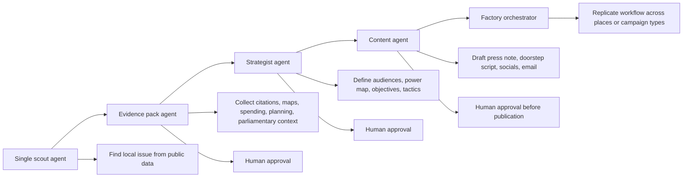

# Designing an AI and Campaigning Demo and Panel

## Executive summary

The notes and chat materials you shared point toward a very specific conference brief: a **10-minute live demo** followed by a **20-minute panel**, aimed primarily at **campaigners and funders**, with some technologists in the room; the session is supposed to let people judge what is “hype versus useful,” and the demo should show a **multiplicity of campaign tasks** through **successive layers of abstraction** rather than a single narrow trick. The strongest recurring motif is a system that starts by finding a **hyperlocal issue** in public data, then expands into **strategy, stakeholder mapping, tactics, lobbying research, and content generation**, with enough scale to feel both exciting and slightly unsettling. fileciteturn0file0 fileciteturn0file3

That makes one concept materially stronger than the others for a live room: a **hyperlocal issue radar that grows into a campaign factory**. It begins with one agent answering a simple question such as “What is the strongest local issue in this constituency right now?” It then adds evidence collection, audience segmentation, strategic planning, content drafting, and finally multi-agent replication across several constituencies or campaign types. This structure directly matches Ed’s “successive layers of abstraction” framing and Hannah’s push to show that agents can do more than research. fileciteturn0file0 fileciteturn0file4

The safest and most convincing live implementation is **public-data-first, UK-centered, and human-in-the-loop**. That means relying on official demographic, electoral, parliamentary, planning, spending, and geography datasets rather than live personal data or a voter CRM. In the UK, the **electoral register is not an open online dataset**, and access to the full register and marked register is tightly controlled; meanwhile, the ICO states that most targeted political messaging to individuals is treated as **direct marketing**, which triggers UK GDPR and PECR obligations. That makes live voter-targeting or doorstep-personalization a poor demo choice for this audience and a high-risk compliance story. citeturn4search0turn4search3turn0search0turn0search8

The recommended demo therefore uses official or primary sources such as the **ONS API and Nomis** for demographics, the **ONS Open Geography Portal** for boundaries, the **Electoral Commission’s election information API** and finance/search tools, **UK Parliament APIs and Hansard**, **Planning Data England**, local and central government **transparency spending data**, and official platform transparency surfaces such as **Meta Ad Library**, **YouTube Data API**, and, where relevant, **TikTok’s Commercial Content API**. citeturn1search4turn23search0turn0search2turn4search10turn0search5turn1search1turn1search9turn3search4turn3search3turn1search3turn2search0turn13search2

## What the notes imply for the session design

I found two directly relevant files in your library: **Notes-with-hannah-+-Ed.txt** and **ai_campaigning_chat_export.txt**. Those files are enough to derive the core session framing. I did **not** separately retrieve the linked rough speaker briefing document or the older deck referenced in the chat, so any finer-grained requirements that live only in those linked documents remain unspecified. fileciteturn0file0 fileciteturn0file3

The notes converge on five design requirements.

First, the demo needs to show **campaign work, not generic AI work**. The examples discussed are campaign-native: constituency scanning, local knowledge, council-minute monitoring, issue detection, competitor analysis, stakeholder mapping, lobbying preparation, doorknocking scripts, local press lists, and tailored cross-channel messaging. fileciteturn0file0 fileciteturn0file8

Second, the demo should show **layering rather than a single reveal**. Ed explicitly frames the concept as “successive layers of abstraction,” and Hannah repeatedly pushes for examples that scale across different audiences, parties, charities, and segments. That strongly favors a walkthrough that starts with one task and progressively adds automation. fileciteturn0file4

Third, the most distinctive substrate in the notes is **open statutory and public-sector data**. The original seed idea is scraping and analyzing public statutory data from public bodies to find hyperlocal campaign ideas or stories; the session then expands from issue identification to strategy and content. This is important because it gives the session a serious, civic-tech backbone rather than making it look like generic social listening dressed up as politics. fileciteturn0file0

Fourth, the room wants both **usefulness and psychological impact**. Hannah explicitly suggests a visual “wow” and even says the room should be “a bit afraid.” That argues for a live sequence where each additional layer demonstrates how quickly institutional scale can emerge from boring public data and standard APIs. fileciteturn0file8

Fifth, the implementation budget and deployment assumptions are modest. The chat suggests a rough prototype budget on the order of a cheap VPS plus optional model routing costs, not a full product build, and Ed explicitly notes that only the first couple of steps may need to be truly working live, with the later layers shown as plausible continuation. That is exactly how a good 10–15 minute demo should be staged: **real first layers, credible later layers, explicit human controls**. fileciteturn0file8

A concise translation from note themes into design implications looks like this:

| Note theme | Implication for the session |
|---|---|
| “10 minute demo,” “20 minute panel,” “hype vs useful” fileciteturn0file0 | The live section must be tightly staged and visibly practical. |
| “Successive layers of abstraction” fileciteturn0file4 | The demo should evolve from one agent to an orchestrated factory. |
| “Not just research” fileciteturn0file4 | Stop at research and the concept underperforms; add strategy and drafting. |
| Hyperlocal issue identification from public data fileciteturn0file0 | Use official, local, public datasets as the foundation. |
| Strategy, MP research, scripts, local press release, social posts fileciteturn0file8 | Make the later layers campaign-operational, not abstract. |
| Audience includes campaigners and funders fileciteturn0file0 | Show cost, speed, governance, and what still needs humans. |

## Campaign-relevant data sources and API landscape

The UK data environment is good enough to build a strong public-data campaign demo without touching real personal voter files. The most important constraint is legal: although registered political parties, candidates, and some campaigners may receive copies of the **full electoral register** and **marked register**, the register is **not an online open dataset**, and its use is constrained. The Electoral Commission also states that campaigners can use the electoral register only to support participation in the election, while the ICO makes clear that most targeted political messaging to individuals counts as direct marketing and therefore engages privacy law. citeturn4search0turn4search3turn0search4turn0search8

That is why the demo should separate **public-data intelligence** from **regulated personal-data operations**. Public-data intelligence is ideal for the conference. Regulated voter operations should be discussed on the panel, not performed live.

### Official and primary sources that are most useful

The strongest official UK sources for a campaigning demo are:

| Category | Official or primary source | Why it matters for campaigning | Main caveats |
|---|---|---|---|
| Election lookup and ballot context | Electoral Commission Election Information API. It returns elections, polling information, and candidate information by postcode. citeturn4search10turn12search22 | Good for “what election is here, who is standing, what is relevant in this place?” moments. | Operational election info, not voter-file analytics. |
| Electoral register and turnout context | Full and marked registers are available only to entitled actors; the register is not online open data. ONS also publishes aggregate electoral registration datasets. citeturn4search0turn4search3turn4search8 | Useful for panel discussion on what campaigns can legally do versus what should stay out of the live demo. | Highly sensitive; access and use are legally bounded. |
| Demographics and socioeconomic context | ONS API is open and unrestricted; Nomis provides REST access to census and labour-market statistics; ONS also offers custom area profiles. citeturn1search4turn23search0turn23search1 | Excellent for constituency, ward, neighbourhood, and custom-area profiling. | Aggregate data; not person-level targeting. |
| Boundaries and geography | ONS Open Geography Portal and digital boundary products. citeturn0search2turn0search10turn0search18 | Needed for maps, constituency overlays, ward drill-down, and area joins. | Boundary complexity can confuse live demos if not precomputed. |
| Planning and housing | Planning Data England API exposes 100+ planning and housing datasets via one interface. citeturn3search0turn3search4 | Great for local controversies and “what is changing here?” issue detection. | Coverage may still be incomplete in some areas. citeturn3search8 |
| Parliamentary records | UK Parliament APIs, Members API, Written Questions API, Register of Interests API, Hansard. citeturn1search1turn1search5turn1search17turn12search2turn1search9 | Useful for MP/minister issue history, accountability, and lobbying prep. | Parliamentary data needs careful summarization to avoid hallucinated claims. |
| Campaign finance and donations | Electoral Commission finance reporting pages and searchable data. citeturn0search5turn7search0 | Useful for transparency, opponent research, and panel discussion on money and infrastructure. | Search is public, but structure is not as developer-friendly as a modern API. |
| Public spending and transparency | Local Government Transparency Code; department spend-over-£25k datasets and data.gov.uk publications. citeturn0search3turn3search3turn3search15 | Good for “follow the money” stories and local accountability campaigns. | Formatting is inconsistent across publishers. |
| Charities and civic organizations | Charity Commission API and downloadable full register. citeturn1search2turn1search6turn1search14 | Useful for coalition mapping, local allies, and issue ecosystems. | England and Wales only. |
| Companies and local economic interests | Companies House API. citeturn3search1turn3search5turn3search13 | Useful for local business mapping, procurement stories, and stakeholder research. | Requires care to avoid unfair inference about individuals. |
| Council meetings and agendas | Councils must publish notices, agendas, and minutes for formal meetings, and minutes should be published online or made available. citeturn10search0turn10search4turn10search5turn10search6 | Important for local issue discovery and monitoring. | No single standard API; ingestion is heterogeneous. |

### Social and platform-facing sources worth using carefully

For campaigning, social sources are best treated as **transparency and signal layers**, not as the foundation of the demo. Meta’s **Ad Library API** allows customized search of social issue, electoral, political, and certain UK/EU ad data. TikTok’s **Commercial Content API** exposes ad-related public data, but TikTok also states that it does **not allow paid political advertising**, so its value is more about broader commercial-content transparency and EU repository access than political ad buying. YouTube’s Data API is still useful for channel and video monitoring, but quotas are finite. X’s API is now **pay-per-usage** and rate-limited, which makes it less ideal as the centerpiece of a short demo unless already provisioned. Bluesky, by contrast, exposes public activity through AT Protocol surfaces and a public firehose, which makes it unusually agent-friendly for open monitoring workflows. Reddit allows developer access, but its developer rules and terms are restrictive around commercial use and use of Reddit data to train or improve LLMs. citeturn1search3turn13search2turn13search5turn13search11turn2search0turn2search8turn2search1turn2search21turn2search2turn2search6turn2search7turn2search3

For a conference demo, the best social layer is therefore:

- **Meta Ad Library** for politics and issue ads. citeturn1search3turn1search11
- **YouTube Data API** for local campaign videos, speeches, and press clips. citeturn2search4turn2search12
- **Optional Bluesky monitoring** if you want a visibly open social layer. citeturn2search2turn2search18

## Project ideas and recommendation

Several viable project concepts emerge from the notes and the current data landscape. They are not equally suitable for a live room.

### Comparison of project ideas

| Project idea | Brief description | Core objective | Required data | Feasibility for live demo | Main risks | Mitigations | Estimated implementation effort |
|---|---|---|---|---|---|---|---|
| **Hyperlocal issue radar and campaign factory** | Find one emerging local issue, assemble evidence, generate strategy, then fan out tailored plans and drafts. | Show how one public-data query becomes campaign infrastructure. | ONS/Nomis, ONS geography, council agendas/minutes, Planning Data, Parliament APIs, Electoral Commission, spending data, optional Meta/YouTube. citeturn1search4turn23search0turn0search2turn10search0turn3search4turn1search1turn0search5turn3search3turn1search3turn2search4 | **High** | Hallucinated issue framing; overclaiming causality; surveillance concerns. | Pre-cache one constituency; require evidence citations; no autonomous publishing; human strategic approval. | **Medium** |
| **Constituency profile and narrative workshop** | Build a rich area profile, segment audiences, propose resonant frames and messages. | Show how agents synthesize demographic and political context. | ONS API, Nomis, ONS geographies, Electoral Commission election info, Parliament APIs. citeturn1search4turn23search0turn0search2turn4search10turn1search1 | **Very high** | Can look too familiar or consultancy-like; less “wow.” | Add live comparison between two constituencies and multiple audiences. | **Low** |
| **Public money watcher** | Monitor spending, procurement, grants, and planning decisions for accountability stories. | Show agents as watchdogs rather than persuaders. | Local Government Transparency Code, spend-over-£25k, data.gov.uk, Planning Data, Companies House. citeturn0search3turn3search3turn3search15turn3search4turn3search1 | **High** | Data messiness; weaker direct link to campaigning tactics. | Use one curated issue and pre-normalized CSVs. | **Medium** |
| **Narrative and opponent research monitor** | Track statements, parliamentary speeches, ad libraries, and platform content for contradictions or openings. | Show rapid opposition research and response drafting. | Hansard, Parliament APIs, Meta Ad Library, YouTube, X/Bluesky where available. citeturn1search9turn1search13turn1search3turn2search4turn2search1turn2search2 | **Medium** | Defamation risk if summarization is sloppy; platform dependency. | Restrict to directly quoted official/public records; separate facts from interpretation. | **Medium** |
| **Voter-file-enhanced GOTV or persuasion copilot** | Join electoral register/marked register or CRM data to generate priority contacts and scripts. | Show maximum campaign power. | Electoral register, marked register, CRM, canvass history, ONS contextual data. citeturn4search0turn4search3 | **Low for live public demo** | Highest privacy, legal, and reputational risk; ethically contentious. | Do not demo live; discuss only as a panel scenario with strict governance. | **High** |

### Why the hyperlocal issue radar should be prioritized

The hyperlocal issue radar is the strongest choice because it satisfies five conditions at once.

It is **legible**. The audience can understand the first question immediately: “What is happening in this place that a campaign should care about?” They do not need to understand agent frameworks first.

It is **public-data-native**. That keeps the demo on much safer legal and ethical ground than a voter-file or CRM demo. This matters for a campaigning audience because they will immediately test the boundary between “clever” and “creepy.” The public-data-first answer is much easier to defend. citeturn4search0turn0search0turn0search8

It is **modular**. You can stop after one agent if time collapses, or continue into strategy, content, and factory replication if the room is engaged.

It is **politically rich**. The same issue can be reframed for a resident association, a trade union branch, a constituency campaign, an environmental NGO, or a local candidate, which directly matches the “agent per campaign” and “agent per segment” ideas in the chat. fileciteturn0file4

It is **panel-friendly**. Once the demo ends, the panel can pivot naturally to centralization, surveillance, misinformation, compliance, and whether this kind of tooling strengthens or weakens democratic practice.

## Recommended live demo

### The concept

The recommended live demo is called **From Scout to Factory**.

The demonstrator starts with a single agent asked to find **one actionable hyperlocal issue** in a constituency or ward using only public sources. That agent returns a ranked shortlist with evidence. A second layer assembles an evidence pack. A third layer turns the evidence into a campaign strategy. A fourth layer drafts assets. A fifth layer shows how the same workflow can be cloned across multiple campaigns, audiences, or places with human approvals and shared rules.

That progression mirrors the notes almost exactly: issue detection, research, segmentation, strategy, tactics, MP/lobbying research, and tailored content. fileciteturn0file0 fileciteturn0file8

### Suggested architecture



### Suggested demo timeline

```mermaid
timeline
    title Ten to fifteen minute live demo arc
    00:00 : Frame the question
    01:00 : Run one scout agent on one place
    03:00 : Show evidence pack and citations
    05:00 : Add strategist layer
    07:00 : Add content drafting layer
    09:00 : Show factory replication across audiences or places
    11:00 : Surface guardrails, approvals, and risks
    13:00 : Hand off to panel
```

A practical run-of-show looks like this:

| Time | What the audience sees | Why it works |
|---|---|---|
| 0:00–1:00 | One-slide framing: “What if a campaign could monitor every council, plan, spending file, and parliamentary record, then turn one issue into a local strategy in minutes?” | Establishes stakes before any tooling. |
| 1:00–3:00 | **Single-agent prototype**: enter a constituency, ask the scout to identify the strongest local issue from public data. | Clean, comprehensible first move. |
| 3:00–5:00 | **Evidence layer**: the system fetches demographics, planning context, council minutes, parliamentary mentions, and relevant spend lines, then produces a cited issue brief. | Demonstrates that the result is not merely generated prose. |
| 5:00–7:00 | **Strategy layer**: an agent converts evidence into goals, target audiences, allies, opponents, power map, and a shortlist of tactics. | Shifts from research to action. |
| 7:00–9:00 | **Content layer**: draft a press release, a doorstep script, a local social post, and a short MP briefing. | Makes the workflow feel immediately operational. |
| 9:00–11:00 | **Factory layer**: clone the workflow for a different audience or campaign type, or across three constituencies, to show scale. | Delivers the “slightly frightening” moment. |
| 11:00–13:00 | **Governance reveal**: show approval gates, prohibited actions, and provenance. | Prevents the room from thinking you are endorsing autonomous campaigning. |
| 13:00–15:00 | **Panel handoff**: “Useful? Dangerous? Centralizing? Democratic? Let’s debate.” | Creates a clean transition into implications. |

If the live slot is truly closer to 10 minutes, compress it by precomputing the evidence layer and revealing the content layer only for one artefact.

### Required technical stack

A lightweight but credible stack is better than an overbuilt one.

| Layer | Recommended choice | Why |
|---|---|---|
| Orchestration | Python with a simple agent harness, or TypeScript if that is your fastest path | The Anthropics guidance strongly emphasizes that useful agents are often just LLMs using tools in a loop; simplicity is an advantage for a live demo. citeturn9search0turn9search7turn9search14 |
| Model runtime | One reasoning-capable model plus one faster/cheaper drafting model | Keeps latency manageable and makes the “different models for different tasks” story concrete. OpenAI and Anthropic both support tool-oriented agent workflows. citeturn9search4turn9search9turn6search4turn6search8turn6search13 |
| Tool surface | Function tools or remote MCP tools for official data fetchers | MCP is specifically designed to expose tools and resources to model clients. citeturn6search2turn6search10turn6search14 |
| Data cache | Local SQLite or DuckDB with pre-cached JSON/CSV extracts | Essential for demo reliability and low latency. |
| Geospatial | GeoJSON plus a simple Leaflet or Mapbox layer using ONS boundaries | Enough for a high-impact map without geo-stack overload. citeturn0search2turn0search10 |
| Frontend | Minimal web UI or notebook dashboard plus one map panel and one trace panel | A live room needs legibility more than polish. |
| Observability | Structured logs / traces per agent step | Lets you show where evidence came from and which agent did what. OpenAI’s agents surfaces now explicitly include tracing and guardrails. citeturn9search15 |
| Safety controls | Allowlisted read-only tools, no autonomous publishing, approval gates before any content export | Necessary for both ethics and room confidence. |
| Optional model routing | OpenRouter only if you want a multi-model “factory” flourish and have tested it thoroughly | Useful but not necessary; it adds provider variability. citeturn6search3turn6search19 |

My recommendation is:

- **Read-only tools only** during the demo.
- **Preload** one constituency and one backup constituency.
- **Cache** every external source used in the live path.
- **Do not** connect a real electoral register, CRM, or outbound posting tool.
- **Show** the architecture for those layers, but do not execute them publicly.

### Sample prompts and agent specs

A useful way to stage the layers is with four visible agents.

#### Scout agent

```text
Role: Hyperlocal issue scout for a UK campaign.
Goal: Identify the top 3 campaign-relevant local issues in [PLACE].
Allowed tools: census_profile, boundary_lookup, council_minutes_search, planning_search, spend_search, parliament_search, election_context.
Requirements:
- Use only retrieved evidence.
- Return ranked issues with confidence score.
- Cite each issue with source titles and dates.
- Explicitly separate "evidence" from "interpretation".
- Do not produce messaging or persuasion copy.
```

#### Evidence pack agent

```text
Role: Research editor.
Goal: Build a one-page evidence pack for the chosen issue.
Allowed tools: scout_outputs, source_fetch, map_render.
Requirements:
- Summarize who is affected, where, and why now.
- Include demographic context and any relevant parliamentary or planning context.
- Flag missing or contradictory evidence.
- Produce a timeline and a source list.
```

#### Strategy agent

```text
Role: Campaign strategist.
Goal: Convert the evidence pack into a practical local campaign plan.
Inputs: issue brief, campaign type, risk tolerance, target audiences.
Requirements:
- Define objective, success metric, likely allies, likely blockers, decision-makers, and next three tactics.
- Provide separate frames for at least 2 audiences.
- Include one "do nothing" or "not recommended" section.
- Avoid any advice that depends on personal data.
```

#### Content agent

```text
Role: Political comms drafter.
Goal: Draft channel-specific assets from an approved strategy.
Requirements:
- Produce a press note, a doorstep opener, and two short social posts.
- Keep every factual claim anchored to the evidence pack.
- Mark all generated text as draft.
- Never publish or schedule anything.
```

#### Factory orchestrator

```text
Role: Workflow manager.
Goal: Replicate the approved workflow across selected places or audiences.
Rules:
- Clone only approved strategies.
- Stop if evidence confidence is low.
- Escalate anything involving personal data, protected characteristics, or unverified claims.
- Generate a run log for every branch.
```

### Failure modes and fallback plans

| Failure mode | What goes wrong live | Fallback |
|---|---|---|
| External API latency | The system stalls while fetching official data | Use pre-cached local JSON and narrate that the live system normally refreshes on a schedule. |
| Sparse or messy council data | Minutes/agendas are unavailable or inconsistent | Switch to planning, parliamentary, or spending data for the same geography. |
| Weak issue ranking | The scout returns bland or ambiguous issues | Preselect one “golden path” issue and say “here’s the one I prepared earlier from the same workflow.” |
| Hallucinated synthesis | The model overstates what the evidence shows | Keep evidence cards visible and force every strategic step to reference them. |
| Map rendering glitch | The visual layer fails | Fall back to a tabular evidence pack and one static screenshot. |
| Content looks too polished and creepy | The room reacts badly | Reveal approval gates and stress that the system is drafting from public evidence, not manipulating individual voters. |
| Audience asks about voter rolls | Conversation shifts to personal-data campaigning | Use it as the transition to legal/ethical boundaries and cite the register restrictions and ICO guidance. citeturn4search0turn4search3turn0search0turn0search8 |

### Audience engagement hooks

The audience hooks should be short and slightly theatrical.

Start with a question that is politically legible: **“Could five people at HQ monitor what used to require hundreds of local volunteers and researchers?”** That precisely hits the note’s centralization concern. fileciteturn0file0

Then use a live branching moment: ask the room whether the issue should be reframed for **a local resident group, a green campaign, or a candidate campaign**. That shows segmentation without touching personal voter data. fileciteturn0file4

Finally, when the factory layer appears, say something close to: **“We have not built an autopilot campaign. We have built a machine that makes centralization newly feasible.”** That tees up the panel’s deeper democratic question.

## Keynote panel talking points

The panel should not merely ask whether the demo is impressive. It should ask whether the workflow is **useful, lawful, democratic, governable, and worth normalizing**.

### A compact pro-and-contrast structure

| Potential upside | Corresponding downside |
|---|---|
| Better local intelligence from fragmented public data | Stronger centralization of campaign power |
| Faster issue discovery and response | More surveillance of public participation and local institutions |
| Lower coordination cost for small teams | Lower barrier to spam, synthetic astroturf, and low-quality campaigning |
| Better evidence packaging | False confidence if evidence quality is weak |
| More access to strategic support for smaller groups | More advantage to actors with compute, data, and ops capacity |

A short, strong panel framing could be:

Public official data in the UK is already rich enough to support high-speed political intelligence: ONS, Parliament, planning, spending, and election information are all machine-consumable enough to be useful. citeturn1search4turn23search0turn1search1turn3search4turn3search3turn4search10

But the legal and ethical line shifts sharply when campaigns move from **public-data interpretation** to **individual targeting**. The ICO’s campaigning guidance stresses that most targeted political messaging is direct marketing and that profiling in political campaigning carries additional obligations. citeturn0search0turn0search8turn5search1

At the same time, the platform and electoral environment is becoming more sensitive to AI risks. In 2026, the Electoral Commission launched a **deepfake detection pilot** to counter AI misinformation, and Ofcom issued an **open letter on elections** explaining how Online Safety Act duties apply during election periods. Those are strong signals that campaign AI is no longer a hypothetical policy issue. citeturn5search0turn5search10

### Suggested talking points list

- **The real opportunity** is not fully autonomous campaigning; it is turning fragmented public information into faster, higher-quality human decisions. citeturn1search4turn1search1turn3search4
- **The real danger** is not only deepfakes. It is the institutional centralization that occurs when a small core team can monitor, interpret, and operationalize hundreds of local signals at once. This danger is implicit throughout the notes and should be named directly. fileciteturn0file0
- **Campaigns should distinguish four layers**: public-data research, strategic synthesis, donor/volunteer/member operations, and voter-contact operations. The first two are easier to justify; the latter two require much stricter governance. citeturn4search0turn0search0turn0search8
- **AI-generated political content should have provenance and approval logs**, even if the law does not yet require universal labeling in every case. The governance argument is stronger if campaigns can show what model, sources, and prompts were used. citeturn9search15turn5search0turn5search3
- **Public-data-first is the right adoption path** for campaigners. Start with official, aggregate, lawful datasets; add personal data only when there is a clear lawful basis, minimization plan, and operational need. citeturn1search4turn23search0turn0search2turn4search0turn0search0
- **No autonomous publishing** should be a baseline norm for political use. Drafting is one thing; unattended outbound messaging is another. That is both safer and easier to defend publicly.
- **Synthetic media readiness now matters**. The Electoral Commission’s 2026 pilot and government guidance on disinformation and AI threats show that campaigners should plan for verification, incident response, and channel monitoring now, not later. citeturn5search0turn5search3turn5search7

### Recommended best practices for campaigners

For campaigners, the clearest best-practice package is:

| Practice | Why it should be recommended |
|---|---|
| Use public, official, aggregate data first | Minimizes privacy and compliance exposure while still delivering value. citeturn1search4turn23search0turn0search2 |
| Treat electoral-register and CRM layers as separate high-governance systems | The underlying data is not open and use is tightly constrained. citeturn4search0turn4search3 |
| Require human approval between research, strategy, and publication | Prevents compounding model error and reduces reputational risk. |
| Preserve provenance for every factual claim | Makes post-hoc correction and accountability possible. |
| Keep tool access read-only by default | Least privilege is especially important when using remote tools and MCP-style integrations. citeturn6search2turn9search3turn9search5 |
| Separate evidence from interpretation in outputs | Reduces hallucinated certainty and strategic overreach. |
| Red-team deepfake and misinformation scenarios | The regulatory and electoral environment is already moving in that direction. citeturn5search0turn5search10turn5search3 |
| Avoid sensitive-category targeting and manipulative personalization | UK data-protection expectations in political campaigning are clear enough that this is a prudent default. citeturn0search0turn5search1 |

The net recommendation is straightforward: **demo the hyperlocal issue radar evolving into a campaign factory, but frame it explicitly as an evidence-and-planning machine with human approvals, not an autonomous persuasion engine**. That aligns with the notes, plays well in a mixed audience, uses defensible data sources, and creates the strongest possible bridge into a substantive panel discussion.