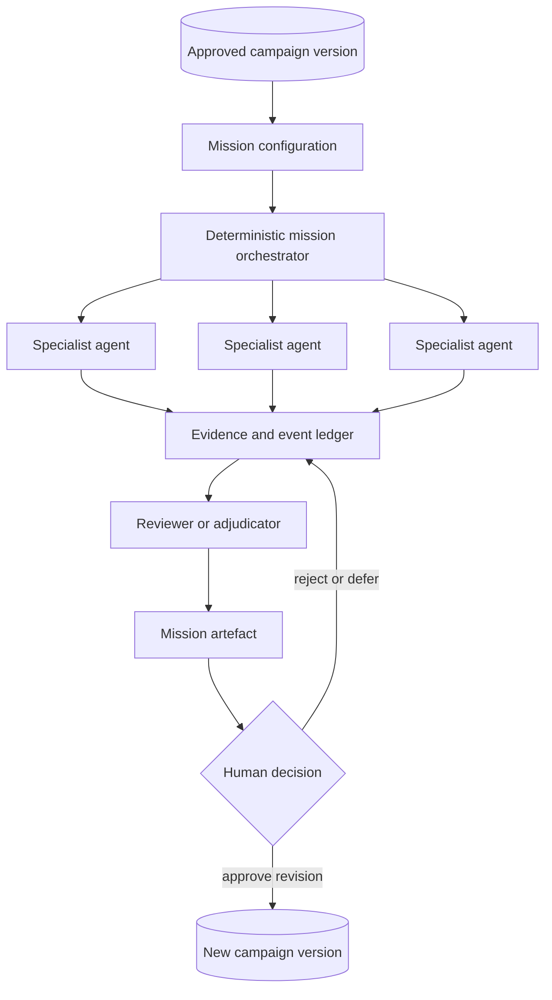

# Mission Bay

**Status:** Implemented conference-prototype scope; eleven catalogue missions remain future concepts
**Last updated:** 14 July 2026
**Purpose:** Explore how Campaign Factory can make agent factories tangible to campaigners after a campaign has been formulated

**Implementation plan and acceptance criteria:**
[`mission-bay-implementation-plan.md`](./mission-bay-implementation-plan.md). The plan
records the catalogue, runtime boundaries, data model, demo fallback and deliberately
deferred watcher infrastructure used by the implementation.

## Product proposition

Mission Bay is a separate page belonging to exactly one Hyperlocal Campaign and entered
from the bottom of that campaign's existing journey.

It lets a campaigner deploy bounded agent missions that investigate, challenge, monitor, or strengthen the campaign already created. Each mission receives the campaign's approved context: problem, evidence, objective, decision route, stakeholders, power analysis, strategy, tactics, organising plan, resources, documents, and known uncertainties.

Mission Bay is not a generic chatbot and not an operations dashboard. It is a visual reference for what agent factories could do for campaigners:

- decompose a substantial campaign question;
- deploy several specialists at once;
- let agents inspect and challenge one another's work;
- use public tools and sources;
- return evidence-backed artefacts;
- stop at meaningful human decisions.

The intended audience response is:

> “I understand how a campaigner could give an entire piece of work to a coordinated agent team, not merely ask a chatbot for another answer.”

## Representational status

Mission Bay is a **Factory Visualisation**: a human-readable model of how campaign work
can be divided among bounded software processes, coordinated, checked, combined, and
returned for human approval. Its bays, teams, workers, hand-offs, and loops are interface
metaphors. They do not claim that autonomous digital employees inhabit the system or
that the screen is a literal runtime topology.

The full explanation belongs in the existing **How this was built** section. That section
currently explains a linear path from campaign input through live research, shared state,
specialist tasks, human review, and resources. The Mission Bay explanation should extend
that story by showing:

- the deterministic orchestration beneath a mission;
- the bounded model and tool calls performing specialist work;
- the shared campaign context and persisted event trail;
- fan-out, challenge, synthesis, and approval loops;
- which mission is operational and which cards represent future capability;
- why the visual team metaphor is useful without being literally true.

Mission Bay itself may carry a concise link or label directing users to this explanation,
but it should not interrupt every mission card with infrastructure disclaimers.

## Place in the campaign journey

The current long-form campaign journey remains the primary experience:

```text
Campaign problem
    -> research
    -> objective and decision route
    -> power and pressure
    -> strategy and tactics
    -> organising and resources
    -> campaign documents
    -> sources and verification
    -> how this was built
    -> Mission Bay
```

Mission Bay appears only once the campaign has enough structured context for an agent to act meaningfully.

Proposed end-of-journey transition:

```text
YOUR CAMPAIGN IS READY

This is the campaign as it stands today.

Now send specialist agent teams to investigate its assumptions,
find new openings, monitor the decision route, or prepare the next move.

[ Enter Mission Bay ]
```

The campaign remains intelligible without entering Mission Bay. The factory is an additional capability, not a replacement for the campaign.

## Core interaction principle: missions before agents

The user should ordinarily choose an outcome, not assemble an artificial organisation chart.

An Agent Mission is deliberately larger than a single model or tool call. To qualify for
the Mission Bay catalogue, a mission must contain:

- at least two independently useful workstreams;
- a fan-out/fan-in, debate, or review pattern;
- a synthesiser, critic, or adjudicator;
- a structured campaign artefact;
- a meaningful human decision at the end.

Lightweight single-agent tasks are **Agent Actions**, not Mission Bay missions. For
example, verifying one claim, retrieving one document, or finding one meeting should be
available contextually in the campaign interface. A whole-campaign evidence audit or a
decision-opportunity mapping exercise may qualify as a mission because it coordinates
several such actions and reconciles their results.

Good:

- Test whether this campaign is viable.
- Find previous campaigns we can learn from.
- Verify the campaign's most important claims.
- Find the next relevant public meetings.
- Watch this decision route for changes.
- Prepare the team for a meeting.
- Assess what this new development changes.

Weak:

- Chat with the Research Agent.
- Chat with the Strategy Agent.
- Chat with the Organising Agent.
- Pick five agent personas and tell them what to do.

An outcome-led mission can visibly assemble a team of agents once deployed. This preserves the approachable “agent boxes” idea without reducing Mission Bay to a catalogue of prompts.

## Proposed page structure

### 1. Campaign context strip

The top of the page anchors every mission to the current campaign:

```text
MISSION BAY

Save the Old Library                          Campaign version 1
Decision: Cabinet approval of disposal       23 verified claims
Place: Northbridge                           4 unresolved questions

[Return to campaign]                         [View evidence]
```

### 2. Suggested missions

The first row contains a small number of high-value missions selected because of the campaign's current state. Suggestions must explain why they are relevant.

Example:

```text
Suggested because the decision route contains an unverified committee date:
[ Find and verify the next public meetings ]
```

### 3. Mission catalogue

Missions are grouped by **Mission Purpose**, reflecting the outcome a campaigner is
trying to achieve:

- Challenge — three canonical missions;
- Investigate — three canonical missions;
- Watch — three canonical missions;
- Prepare — three canonical missions.

The Mission Catalogue is deliberately fixed at twelve cards for this concept. It is the
complete curated capability map, not a claim to enumerate every useful agent task. New
ideas must displace or materially reshape an existing mission rather than accumulating
indefinitely.

Factory sophistication is a separate visual dimension, not the catalogue hierarchy.
Every mission card identifies its **Factory Pattern** and shows a compact representation
of agents splitting work, checking or contesting results, and recombining around a human
decision. Initial patterns are:

- **Parallel Team** — independent workstreams fan out and a synthesiser combines them;
- **Tribunal** — competing assessments are tested and an adjudicator exposes agreement
  and disagreement;
- **Persistent Loop** — agents revisit approved public sources over time and surface
  candidate changes;
- **Response Loop** — a verified change is traced through the campaign and proposed
  revisions are reviewed;

Purpose answers **why deploy this mission?** Factory Pattern answers **how does this
factory coordinate the work?** Terms such as “research swarm” should therefore appear in
mission details and `How this was built`, not as the primary way campaigners browse.

Mission Bay does not contain missions that span multiple campaigns. A future portfolio
or Factory Map may show several independent Mission Bays and their supervised loops, but
it owns a different context and must not imply that hyperlocal campaigns are variants of
one central template.

For the conference prototype, the catalogue is intentionally broader than the
implemented runtime. The page should show the credible mission landscape, while making
availability unmistakable:

- exactly one flagship mission is available to deploy;
- future missions remain visible as **Coming soon**;
- coming-soon cards may explain their team, tools, and intended artefact, but cannot
  imitate a live run;
- future missions are curated evidence of the product direction, not an exhaustive list
  of every agent that could be invented.

This lets campaigners see the prospective factory without pretending the entire factory
has been built. It also gives the working mission more visual and narrative importance.

### 4. Active and completed missions

Below the catalogue, the user can see running missions, findings awaiting review, and completed artefacts. This is a mission history, not a permanent operations console.

## Initial twelve-mission catalogue

This initial list predates the Agent Mission admission rule above. Each entry must now be
tested against that rule: undersized entries should be expanded into genuinely
coordinated outcomes, moved into the campaign as Agent Actions, or removed. Agent teams
must not be manufactured merely to preserve a card.

### Challenge

#### Viability Tribunal

**User question:** Can this campaign actually win?

The mission assembles:

- a Campaign Feasibility Assessor;
- a Red-Team Strategist;
- a Resource Constraint Analyst;
- an Evidence Checker;
- an Adjudicator.

The agents develop competing assessments rather than five versions of the same answer. The adjudicator identifies agreements, unresolved disagreements, assumptions carrying the most risk, and changes that could improve viability.

**Output:** A viability verdict, evidence, contested assumptions, failure conditions, and recommended changes.

**Human control:** The tribunal cannot alter the campaign objective or strategy.

#### Institutional Response Simulation

**User question:** How might the institution and other campaign actors respond to our strategy?

The mission assembles independent workstreams to examine formal institutional options,
publicly evidenced incentives and constraints, likely counterarguments, procedural
responses, and the ways allies or opponents could alter the campaign environment. A
scenario reviewer builds a branching response tree and separates evidence-backed
expectations from speculation.

**Output:** A sourced response tree, campaign vulnerabilities, early warning signs,
contingencies, and an explicit evidence-versus-inference ledger.

**Human control:** Scenarios cannot be presented as the intentions or positions of named
people. They inform human judgement and do not automatically alter the strategy.

#### Minimum Viable Win

**User question:** Is there a smaller decision we could win first?

Independent workstreams search the formal decision route, policy alternatives, campaign
resources, coalition opportunities, and organising value for intermediate, concrete
outcomes. An evaluator tests each candidate for meaningful substantive value,
feasibility, momentum or power-building value, risk of displacement, and relationship to
the main objective.

**Output:** Candidate stepping-stone wins with decision-maker, timing, value, risk, and
relationship to the main objective—or an explicit finding that no credible smaller win
preserves enough of the campaign's purpose to recommend.

**Human control:** The mission cannot replace or dilute the approved objective. It must
identify and reject Token Wins rather than recommend a concession merely to produce a
positive result.

### Investigate

#### Campaign Precedent Scout

**User question:** What previous or similar campaigns can we learn from?

The mission should not merely return a list of campaigns. It searches several dimensions in parallel:

- campaigns concerning a similar decision;
- campaigns using a similar pressure mechanism;
- campaigns involving comparable institutions;
- campaigns that failed or produced unintended consequences;
- relevant legal, policy, or procedural precedents.

An evaluator then distinguishes genuine comparators from superficial similarities.

**Output:** A precedent dossier containing transferable lessons, important differences, sources, and questions for local campaigners.

#### Formal Decision-Route Audit

**User question:** Is our documented understanding of who formally decides, through which process, and when correct?

It treats the campaign's existing Formal Decision Route as a hypothesis. Independent
workstreams inspect legislation or regulation where relevant, council constitutions and
schemes of delegation, committee papers and minutes, consultations, planning processes,
public-body records, and Parliament where applicable. An evidence adjudicator compares
the findings with the existing route.

Every asserted stage requires an original public record and retrieval date. Aggregators
may locate evidence but do not become the authoritative source. Informal influence is
excluded from the verified route and remains separately labelled strategic inference.

**Output:** A confirmed, qualified, conflicted, or unverified finding for each route
stage; missing evidence; and proposed corrections to the campaign.

**Human control:** The audit may conclude that the route cannot be verified. Proposed
corrections do not alter the campaign until a human approves them.

#### Whole-Campaign Evidence Audit

**User question:** Which important campaign claims still hold up?

It fans out the campaign's material factual claims across verification workers, retrieves
original public evidence, and uses source-conflict and evidence adjudication steps to
identify support, qualification, conflict, staleness, or absence. Strategic inferences
and local knowledge claims are classified separately rather than falsely “verified.”

**Output:** A dated evidence-health report, claim-level findings, source conflicts,
research gaps, and a review queue. Earlier results remain visible.

**Human control:** The audit cannot silently replace claims, citations, or campaign
documents. The campaigner reviews proposed evidence changes and decides which require
local investigation.

### Watch

#### Meeting Finder

**User question:** Which upcoming public meetings could affect this campaign?

It searches relevant council meetings, committees, agendas, minutes, consultations, planning processes, public bodies, and parliamentary activity where the campaign's decision route requires them.

**Output:** Relevant meetings and deadlines, reasons for relevance, supporting public sources, and confidence. It must distinguish a meeting mention from an actual decision opportunity.

#### Decision-Route Watcher

**User question:** Tell me when something material changes.

This is the primary persistent mission. The user reviews the institutions, sources, search scope, cadence, and exclusions before deployment.

The watcher surfaces candidate events. It does not silently update the campaign. A candidate event can trigger a Verification Run and, once verified, a Change Impact mission.

**Output:** Dated candidate events with public provenance and a proposed next investigation.

**Human control:** Visible stop control, scope, owner, cadence, and history.

#### Consultation and Deadline Watch

**User question:** Are there public windows we could miss?

It looks for relevant consultations, objection periods, agenda-publication dates, committee meetings, and decision deadlines.

**Output:** A sourced deadline brief with uncertainty and timezone handled explicitly.

### Prepare

#### Meeting Preparation Team

**User question:** Prepare us for the next meeting.

It assembles current verified evidence, desired commitments, questions, anticipated objections, rebuttals, local knowledge gaps, and follow-up tasks.

**Output:** A reviewable human meeting pack. It does not request, attend, record, or follow up on the meeting autonomously.

#### Campaign Change Response

**User question:** What does this new development change?

A verifier checks the development. An impact agent traces affected assumptions, decision stages, stakeholders, tactics, deadlines, and documents. Resource agents draft only the necessary revisions. Review agents check the proposed changes.

**Output:** An impact map and proposed diffs, held for approval.

#### Resource Expansion Team

**User question:** What operational materials does this campaign need next?

It can produce campaign-specific artefacts beyond the fixed nine documents, such as a coalition pack, meeting plan, community event plan, volunteer briefing, rapid-response kit, or research dossier.

**Output:** Selected artefacts with sources and approval status, not an indiscriminate pile of content.

## Mission card anatomy

```text
┌────────────────────────────────────────────┐
│ VIABILITY TRIBUNAL                         │
│                                            │
│ Tests whether this campaign can win.       │
│                                            │
│ 5 agents · 3 evidence tools · about 90 sec │
│ Produces: verdict and revision brief       │
│                                            │
│ Reads: campaign, sources, strategy         │
│ Cannot: change or publish the campaign     │
│                                            │
│ [Configure mission]       [Deploy team]    │
└────────────────────────────────────────────┘
```

Every card should disclose:

- the campaign question it answers;
- its Mission Purpose and Factory Pattern;
- what context it receives;
- which public tools it can use;
- the artefact it will produce;
- whether it is one-off or persistent;
- approximate time or scope;
- what it cannot do;
- where human approval occurs.

Agent counts should be real. Inflating the number damages the concept.

## Visible orchestration

When a mission runs, its card expands into a temporary team:

```text
VIABILITY TRIBUNAL                         Running 01:08

Feasibility Assessor       Complete       3 conditions found
Red-Team Strategist        Complete       4 weaknesses found
Precedent Scout            Running        Reviewing 8 precedents
Evidence Checker           Challenging    2 unsupported claims
Adjudicator                Waiting        Needs precedent report
```

The interface may reveal dependencies as a small graph, but the plain-language event stream should carry the explanation:

```text
14:02  Tribunal decomposed the viability question into four investigations
14:03  Red team challenged the assumed decision deadline
14:03  Evidence checker requested the source behind that deadline
14:04  Precedent scout rejected three superficial comparisons
14:05  Adjudicator is assembling the verdict
```

This activity must reflect persisted runtime events or be labelled as a recorded demonstration. Decorative animations must not imply work that did not happen.

## Output contract

Missions return structured artefacts, not chat transcripts.

Every mission result should contain:

1. **Answer or verdict** — what the mission concluded.
2. **Evidence** — public sources and retrieval dates supporting factual claims.
3. **Disagreement** — where agents or sources did not agree.
4. **Uncertainty** — what remains unknown or requires local knowledge.
5. **Campaign impact** — which parts of the campaign may be affected.
6. **Recommendations** — proposed next actions or revisions.
7. **Human decision** — approve, reject, defer, investigate, or create a task.
8. **Audit history** — mission scope, tools, context version, and completion state.

## Technical shape



The orchestrator should own scheduling, retries, budgets, permissions, schemas, and mission state. Agents should own bounded interpretation, research choices, comparison, critique, and drafting.

Minimum mission records:

- mission template;
- mission run;
- campaign-version input;
- worker task;
- tool event;
- evidence item;
- finding;
- disagreement;
- artefact;
- proposed campaign change;
- human decision.

## Conference demonstration

Mission Bay should provide one short, legible factory sequence after the completed campaign is revealed.

Recommended sequence:

1. Enter Mission Bay from the bottom of the campaign.
2. Show that missions already understand this campaign.
3. Deploy one coordinated mission, preferably **Viability Tribunal** or **Campaign Change Response**.
4. Show agents splitting the work and challenging one another.
5. Reveal the structured result and unresolved disagreement.
6. Stop at the human decision.
7. Briefly show other available missions, including the persistent Decision-Route Watcher.

The watcher explains where the technology is headed; the live coordinated mission demonstrates factory power now.

## What should be real for the prototype

- campaign context passed into a mission;
- deterministic mission decomposition;
- at least two genuinely parallel specialist tasks;
- one reviewer or adjudicator step;
- persisted task events;
- source-backed output;
- one visible disagreement or challenge;
- explicit human approval;
- a real Mission Bay route attached to the current campaign.

## What may be recorded or seeded

- council or parliamentary source material selected for demo stability;
- additional mission histories;
- a persistent watcher returning after an elapsed period;
- a larger number of available missions;
- long-running precedent research.

Recorded and seeded elements must be labelled. Their data shapes should match the real runtime.

## Non-goals and boundaries

Mission Bay does not:

- provide generic open-ended chat as its primary interaction;
- publish, submit, message, lobby, or contact anyone;
- profile identifiable voters or optimise personal persuasion;
- invent community voices or claim local support;
- silently change the approved campaign;
- present simulated positions as facts about real people;
- treat an aggregator as stronger evidence than the original public record;
- equate agent activity with campaign progress;
- add agents solely to increase the visible count.

## Suggested prototype scope

### Build first

1. Mission Bay page and campaign context strip.
2. Shared mission-card and run-detail components.
3. Exactly one working flagship coordinated mission.
4. Structured mission artefact and human review state for that mission.
5. The wider curated mission catalogue, visibly and consistently marked **Coming soon**.
6. Preview details for future missions: intended team, public tools, output, and human
   control boundary.

### Defer

- live execution for every non-flagship mission;
- arbitrary user-composed agent teams;
- continuous multi-campaign operations;
- autonomous campaign revision;
- private campaign contact data;
- outcome-learning agents;
- broad coverage of every council system.

## Open decisions

1. Is **Mission Bay** the final name?
2. Which single mission is available to deploy in the conference prototype: the
   Viability Tribunal, Campaign Change Response, or another mission?
3. Do users primarily see mission cards, agent cards, or mission cards that expand into agent teams?
4. Which missions are available for every campaign and which are suggested contextually?
5. How much mission configuration should happen before deployment?
6. Should agent identities be functional roles, named characters, or visually anonymous workers?
7. Where do completed mission artefacts live: inside Mission Bay, in the document library, or both?
8. Can persistent watchers be activated in the conference prototype, or only demonstrated through recorded runs?
9. Which council or parliamentary source provides the safest Meeting Finder demonstration?
10. How should cost, duration, and tool use be shown without overwhelming campaigners?

## Current recommendation

Use **Mission Bay** as the working name and make it mission-first. Show the individual agents only after a campaigner deploys a mission.

For the conference prototype, show the broader curated catalogue but implement exactly
one mission. Mark every other mission **Coming soon** rather than simulating interactivity.

The flagship interaction should demonstrate coordinated disagreement and synthesis. The Decision-Route Watcher should then show that the same factory can continue working after the mission ends.

This combination explains both sides of agent factories:

- many specialists can complete a substantial piece of campaign work together now;
- bounded agents can remain available for future investigation when the campaign changes.
