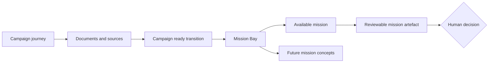
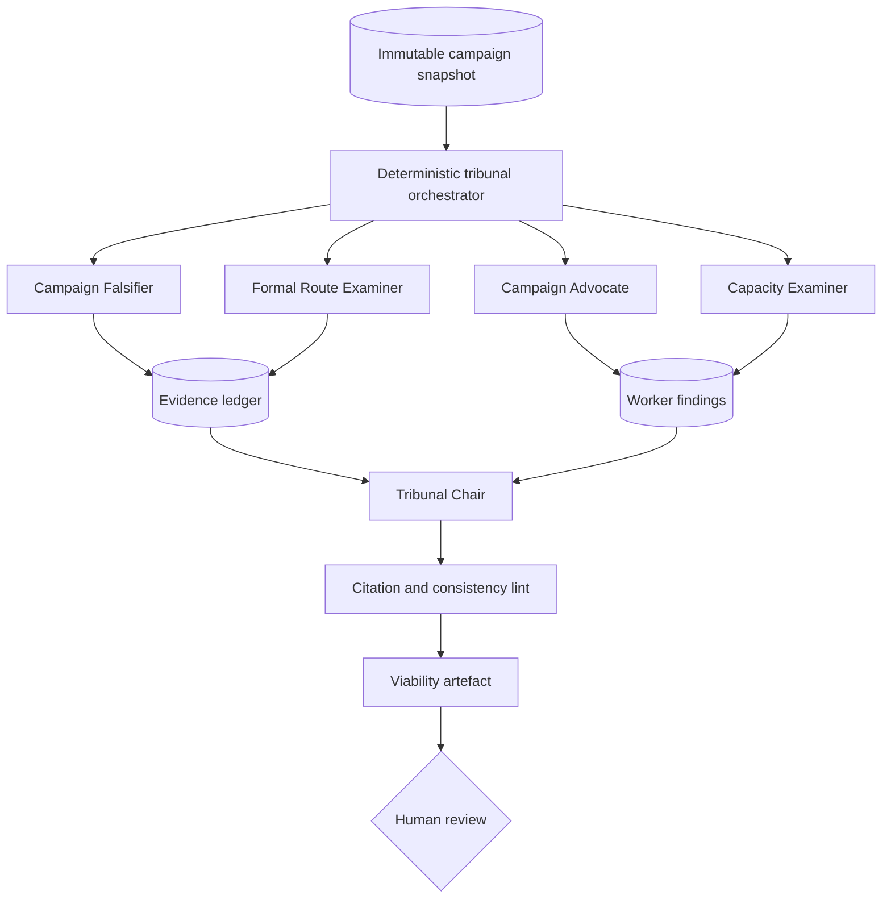

# Mission Bay Implementation Plan

**Status:** Implemented conference-prototype scope on `codex/mission-bay`; watcher missions remain catalogue previews
**Date:** 14 July 2026
**Implementation target:** `web/`, the production Next.js application
**Not an implementation target:** `app/`, the reference-only localhost prototype

## 1. Executive decision

Build Mission Bay as a campaign-specific second act at `/c/[campaign-id]/missions`.

The page presents twelve canonical multi-agent missions organised by campaign purpose:
Challenge, Investigate, Watch, and Prepare. Exactly one mission, the **Viability
Tribunal**, is functional in the conference prototype. The other eleven make the future
factory visible without fabricating runtime activity.

Mission Bay is not a chat surface, agent marketplace, operations console, or literal
diagram of processes living on servers. It is a **Factory Visualisation**: a legible view
of how a substantial campaign outcome can be split into independent workstreams,
challenged, recombined, and returned for a human decision.

The recommended prototype proves one pattern deeply:

```text
Approved campaign snapshot
        ↓
four independent examinations run in parallel
        ↓
evidence and disagreements are reconciled
        ↓
an adjudicator produces a viability verdict
        ↓
the campaigner reviews it; the campaign is not silently changed
```

Everything else is a truthful, structured preview of where the factory could go next.

## 2. Decisions already settled

These are treated as product constraints, not open design questions:

1. A Mission Bay belongs to exactly one Hyperlocal Campaign.
2. Mission Bay preserves the existing long-form campaign journey.
3. Users choose missions by campaign purpose, not by agent persona or technical pattern.
4. The catalogue contains twelve canonical missions, three per purpose.
5. Every Mission Bay mission coordinates multiple agents.
6. A mission requires at least two independently useful workstreams, a synthesis,
   critique, or adjudication step, a structured artefact, and a human decision.
7. A lightweight single-agent task is an Agent Action and does not receive a catalogue
   card.
8. Factory sophistication is shown as visual metadata on each mission, not as the
   catalogue hierarchy.
9. Portfolio-scale orchestration sits outside Mission Bay.
10. The detailed explanation of Mission Bay as a factory visualisation belongs in
    `How Campaign Factory works`.
11. No mission publishes, contacts, lobbies, submits, or silently rewrites a campaign.
12. Public evidence, provenance, uncertainty, and human approval remain visible.

No ADR is proposed. These are still product-shape decisions and remain inexpensive to
change before implementation.

## 3. Recommended defaults

| Decision | Recommended default |
|---|---|
| Working product name | Mission Bay |
| Route | `/c/[id]/missions` |
| Functional mission | Viability Tribunal |
| Catalogue size | 12 missions |
| Primary organisation | Challenge, Investigate, Watch, Prepare |
| Availability labels | Available now, Up next, Future mission concept |
| Who may launch | Campaign owner only |
| Who may view | Anyone who can view the private-by-default campaign URL |
| Campaign mutation | None in the prototype |
| Human review action | Mark reviewed, reject, or needs local knowledge |
| Runtime truth | Live or recorded-live only, never simulated agent activity |
| Target live latency | Under 120 seconds, subject to five-run benchmark |
| Demo fallback | A completed real rehearsal mission, labelled Recorded live run |
| Persistent watchers | Catalogue preview only until durable execution exists |

## 4. Product position in the existing journey

The current journey remains the primary experience. Mission Bay is introduced only after
the campaign has enough structured context to supervise a substantial mission.



Recommended end-of-journey transition:

> **This campaign is ready. What should the factory do next?**
> Send a coordinated agent team to challenge its assumptions, investigate unresolved
> questions, watch the public decision route, or prepare the next move.

Primary action: **Enter Mission Bay**
Secondary action: **How agent factories work**

The CTA is appended after the final journey content. It does not turn Mission Bay into a
fourteenth rung in the campaign analysis itself.

## 5. Information architecture

### 5.1 Page structure

```text
MISSION BAY
Campaign context strip
Factory visualisation caption and How it works link

Featured bay: Viability Tribunal                 AVAILABLE NOW
Large deploy area, outcome, limits, factory pattern

CHALLENGE
2 compact future mission rows

INVESTIGATE
3 compact future mission rows

WATCH
3 compact future mission rows

PREPARE
3 compact future mission rows

Previous mission runs and findings awaiting review
```

The page should not be twelve identical cards. The real mission receives the strongest
visual weight. Future missions appear as compact rows within four purpose bands. Each row
can expand inline to show intended agents, tools, artefact, and safety boundary.

### 5.2 Campaign context strip

The strip anchors every mission to one campaign:

```text
MISSION BAY
Save the Old Library
Place: Northbridge
Formal decision: Cabinet approval of disposal
Sources: 23 labelled claims
Campaign generated: 14 July 2026
```

No agent may receive a different campaign implicitly. The mission run records the exact
campaign snapshot and a content hash.

### 5.3 Factory visualisation caption

Recommended compact copy:

> Mission Bay visualises how an agent factory divides, checks, and recombines campaign
> work. These are bounded software processes, not autonomous digital employees. Every
> result returns to a person for review.

Link: **See how Mission Bay works** → `/how#mission-bay`

### 5.4 Mission row anatomy

Each mission discloses:

- the campaign question it answers;
- its availability;
- its Factory Pattern;
- the coordinated workstreams it would run;
- the public tools or campaign state it would use;
- the artefact it would return;
- whether it is one-off or persistent;
- what it cannot do;
- the human decision at the end.

Agent counts are shown only when they match the runtime or an explicitly labelled future
design. Coming-soon rows never animate as though work is occurring.

## 6. The twelve-mission catalogue

### 6.1 Challenge

#### 1. Viability Tribunal

- **Availability:** Available now
- **Question:** Can this campaign actually win?
- **Pattern:** Tribunal
- **Team:** Campaign Advocate, Campaign Falsifier, Formal Route Examiner, Capacity
  Examiner, Tribunal Chair
- **Artefact:** Viability verdict, agreements, disagreements, failure conditions,
  evidence, unknowns, and recommended changes
- **Human decision:** Mark reviewed, reject findings, or request local-knowledge review
- **Cannot:** Alter the objective, strategy, tactics, or documents

#### 2. Institutional Response Simulation

- **Availability:** Future mission concept
- **Question:** How might the institution and other campaign actors respond to our
  strategy?
- **Pattern:** Tribunal
- **Team:** Formal Options Analyst, Institutional Incentives Analyst, Counterargument
  Researcher, Procedural Response Analyst, Scenario Reviewer
- **Artefact:** Branching response tree, early warning signs, vulnerabilities,
  contingencies, and evidence-versus-inference ledger
- **Human decision:** Select scenarios for contingency planning
- **Cannot:** Present scenarios as the intentions or positions of named people

#### 3. Minimum Viable Win

- **Availability:** Future mission concept
- **Question:** Is there a smaller meaningful decision we could win first?
- **Pattern:** Parallel Team
- **Team:** Decision-Route Analyst, Policy Alternatives Analyst, Resource Analyst,
  Coalition and Organising Analyst, Win Evaluator
- **Artefact:** Ranked stepping-stone wins or a finding that no credible smaller win
  preserves enough of the campaign's purpose
- **Human decision:** Retain the current objective or investigate a stepping-stone win
- **Cannot:** Replace the approved objective or recommend a Token Win merely to produce a
  positive answer

### 6.2 Investigate

#### 4. Campaign Precedent Review

- **Availability:** Future mission concept
- **Question:** What previous campaigns offer relevant lessons, and where does the
  comparison break down?
- **Pattern:** Parallel Team
- **Team:** Issue Comparator, Institution Comparator, Pressure-Mechanism Comparator,
  Failure and Unintended-Effects Researcher, Transferability Evaluator
- **Artefact:** Comparative precedent dossier with successful, failed, partial, and
  unintended outcomes; similarity matrix; evidence quality; and limits to transfer
- **Human decision:** Select precedents for deeper local discussion
- **Cannot:** Claim that a tactic caused an outcome without supporting evidence

#### 5. Formal Decision-Route Audit

- **Availability:** Up next
- **Question:** Is our documented understanding of who formally decides, through which
  process, and when correct?
- **Pattern:** Parallel Team
- **Team:** Authority Researcher, Council or Public-Body Procedure Researcher,
  Consultation or Planning Researcher, Parliamentary Researcher when relevant, Evidence
  Adjudicator
- **Artefact:** Confirmed, qualified, conflicted, or unverified finding for each route
  stage; missing evidence; and proposed corrections
- **Human decision:** Approve, reject, or investigate proposed route corrections
- **Cannot:** Treat inferred informal influence as verified authority

#### 6. Whole-Campaign Evidence Audit

- **Availability:** Up next
- **Question:** Which material campaign claims still hold up?
- **Pattern:** Parallel Team
- **Team:** Claim Dispatchers grouped by institution or evidence type, Source Conflict
  Resolver, Citation Checker, Evidence Adjudicator
- **Artefact:** Dated evidence-health report, claim-level findings, source conflicts,
  stale evidence, research gaps, and review queue
- **Human decision:** Accept, reject, or assign local follow-up for proposed evidence
  changes
- **Cannot:** Treat absence of public evidence as proof that a claim is false

### 6.3 Watch

#### 7. Decision-Route Watcher

- **Availability:** Up next, blocked on durable execution
- **Question:** Has anything material changed in the public process governing this
  campaign?
- **Pattern:** Persistent Loop
- **Team:** Council Agenda and Minutes Watcher, Public-Body Watcher, Consultation or
  Planning Watcher, Parliamentary Watcher when relevant, Relevance and Verification
  Reviewer
- **Artefact:** Dated candidate events with public provenance, relevance, confidence,
  and proposed next investigation
- **Human decision:** Verify, dismiss, defer, or stop watching
- **Cannot:** Update the campaign, contact anyone, or treat a detected mention as a
  decision opportunity without review

This mission absorbs the earlier Meeting Finder and Consultation and Deadline Watch.
Those were overlapping views of the same Formal Decision Route and were too small or too
duplicative to justify separate cards.

#### 8. Evidence Freshness Watch

- **Availability:** Future mission concept
- **Question:** Have the public sources supporting this campaign changed, expired, or been
  superseded?
- **Pattern:** Persistent Loop
- **Team:** Source Monitors grouped by institution, Document Change Detector, Claim Impact
  Mapper, Evidence Reviewer
- **Artefact:** Source-change report, affected claims, proposed Verification Runs, and
  evidence-health trend
- **Human decision:** Launch re-verification or dismiss the change
- **Cannot:** Silently replace evidence or infer that a changed page changes the policy

#### 9. Local Public Narrative Watch

- **Availability:** Future mission concept
- **Question:** Has the public framing around this local issue materially changed?
- **Pattern:** Persistent Loop
- **Team:** Local Media Watcher, Public-Body Communications Watcher, Public Community-
  Organisation Watcher, Narrative Comparison Analyst, Ethics and Relevance Reviewer
- **Artefact:** Sourced narrative-shift briefing, emerging counterarguments, important
  absences, and questions for local campaigners
- **Human decision:** Investigate, ignore, or prepare a human response
- **Cannot:** Profile individuals, monitor private groups, infer voter attitudes, or
  manufacture community support

### 6.4 Prepare

#### 10. Decision-Maker Meeting Pack

- **Availability:** Future mission concept
- **Question:** What does our human team need for the next decision-maker meeting?
- **Pattern:** Parallel Team
- **Team:** Evidence Briefer, Commitment and Ask Designer, Objection Researcher, Local
  Knowledge Gap Finder, Pack Reviewer
- **Artefact:** Meeting brief, desired commitments, questions, sourced talking points,
  anticipated objections, unknowns, and follow-up checklist
- **Human decision:** Edit and approve the human meeting pack
- **Cannot:** Request, attend, record, or follow up on a meeting

#### 11. Campaign Change Response

- **Availability:** Up next
- **Question:** What does this verified new development change?
- **Pattern:** Response Loop
- **Team:** Development Verifier, Assumption Impact Analyst, Decision-Route Analyst,
  Tactics and Deadline Analyst, Document Diff Team, Consistency Reviewer
- **Artefact:** Campaign impact map and proposed diffs to affected claims, route, strategy,
  tactics, deadlines, and resources
- **Human decision:** Approve selected revisions into a future campaign version
- **Cannot:** Modify the current campaign in the conference prototype

#### 12. Next-Move Operations Pack

- **Availability:** Future mission concept
- **Question:** What does the human campaign team need to execute the next phase?
- **Pattern:** Parallel Team
- **Team:** Phase and Dependency Planner, Volunteer Capacity Analyst, Coalition
  Preparation Agent, Event or Action Planner, Resource Writer, Consistency and Ethics
  Reviewer
- **Artefact:** A deliberately selected operations pack, such as volunteer briefing,
  coalition pack, event plan, contact plan, research tasks, and rapid-response checklist
- **Human decision:** Select, edit, and approve the materials the team will use
- **Cannot:** Create an indiscriminate content pile, assign work to real people, or send
  materials

## 7. Why Viability Tribunal is the functional mission

Viability Tribunal is the best first proof because it visibly demonstrates coordination,
adversarial review, disagreement, evidence use, and synthesis in one bounded interaction.
It answers a question campaigners care about and does not require persistent infrastructure
or external political action.

Its weakness is equally important: implemented badly, it becomes five prompts wearing
name badges. The runtime must therefore enforce distinct inputs, tools, outputs, and
dependencies.

### 7.1 Runtime graph



### 7.2 Worker contracts

| Worker | Receives | Tools | Must produce |
|---|---|---|---|
| Campaign Advocate | Full campaign snapshot | Campaign state only | Strongest evidence-backed case for viability; necessary conditions |
| Campaign Falsifier | Pivotal claims, objective, theory of change | Narrow public web research | Contrary evidence, disconfirming conditions, unresolved claims |
| Formal Route Examiner | Existing route, institutions, dates | Official public-source research | Verified and unverified leverage points, timing risks, authority gaps |
| Capacity Examiner | Strategy, tactics, organising, resources | Campaign state and deterministic checks | Resource mismatches, dependency risks, minimum capacity conditions |
| Tribunal Chair | Four worker reports and evidence ledger | No new research | Verdict, agreements, disagreements, uncertainty, failure conditions, revision brief |
| Citation lint | Draft artefact and fetched evidence | Fetched-source ledger | Broken or unsupported references, status corrections, blocking flags |

The Chair cannot see hidden chain-of-thought and cannot erase disagreements. It may ask a
worker for one bounded correction, but the prototype has no recursive delegation.

### 7.3 Verdict schema

```ts
type ViabilityVerdict = {
  verdict: "viable" | "viable_with_changes" | "uncertain" | "not_currently_viable";
  summary: string;
  confidence: "high" | "medium" | "low";
  agreements: Finding[];
  disagreements: Disagreement[];
  pivotalAssumptions: AssumptionFinding[];
  failureConditions: FailureCondition[];
  recommendedChanges: ProposedChange[];
  localKnowledgeQuestions: string[];
  evidence: MissionEvidence[];
  lintFlags: MissionLintFlag[];
};
```

No verdict value automatically changes the campaign.

### 7.4 Model and tool routing

Recommended initial routing, configurable rather than hard-coded:

- Sonnet workers for bounded analysis and public-source research;
- Opus for the Tribunal Chair only if benchmarking shows materially better synthesis;
- Haiku for citation and consistency lint;
- at most two narrow public searches per research worker;
- `Promise.allSettled` fan-out for the four workers;
- one retry for schema or transient tool failure, never an unbounded loop.

The latency and cost targets are budgets to test, not claims. Benchmark five runs against
the real conference campaign before choosing model effort and whether Opus is justified.

## 8. Mission run experience

### 8.1 Before deployment

The available mission expands inline. The campaigner sees:

- exact campaign version and generation date;
- which campaign sections the mission reads;
- which workers will run;
- which workers may use public research;
- approximate time based on measured runs;
- the artefact produced;
- what cannot happen;
- estimated spend if the product owner chooses to expose it.

Primary action: **Deploy tribunal**
Secondary action: **View the factory pattern**

### 8.2 While running

Use four worker lanes that converge into the Chair. Do not use fake typing, chat bubbles,
or personality avatars.

```text
VIABILITY TRIBUNAL                                  01:07

Campaign Advocate       Complete     3 viability conditions
Campaign Falsifier      Researching  2 official records retrieved
Formal Route Examiner   Challenging  committee date remains unverified
Capacity Examiner       Complete     2 resource mismatches
Tribunal Chair          Waiting      needs route examination
```

The event stream exposes actions and state, not chain-of-thought:

```text
15:42  Tribunal created four independent examinations
15:43  Formal Route Examiner retrieved an official committee paper
15:43  Campaign Falsifier challenged one pivotal assumption
15:44  Tribunal Chair received three of four reports
```

Every event is persisted before display. If an event did not occur, the interface does
not animate it.

### 8.3 Result

The result prioritises the campaign conclusion:

1. verdict and confidence;
2. conditions required for viability;
3. agreements;
4. unresolved disagreements;
5. failure conditions;
6. evidence and retrieval dates;
7. local knowledge questions;
8. recommended changes;
9. human review state;
10. run record and cost.

The result is an artefact, not a transcript. It can be copied or downloaded.

### 8.4 Human decision

Because the current production campaign is read-only, prototype decisions are deliberately
limited:

- **Mark reviewed**
- **Reject findings**
- **Needs local knowledge**

The interface may offer **Download revision brief**, but not **Apply changes**. Applying
mission results requires campaign versioning and belongs after the conference.

## 9. Visual design direction

### 9.1 Scene

A campaigner is reviewing a dense local campaign on a laptop in a bright conference room,
while the same screen must remain legible when projected. This calls for the existing
light editorial product language, strong dark type, restrained purple interaction colour,
and limited pastel state fields. It does not call for a dark operations dashboard.

### 9.2 Relationship to the current design

Preserve the existing production app's:

- Inter Tight and Instrument Serif pairing;
- light background and strong ink hierarchy;
- purple action colour;
- pastel blue, yellow, green, and purple information fields;
- pill controls, verification chips, numbered journey rhythm, and simple node diagrams.

Do not reproduce the equal three-column document-card grid for the catalogue. The page
needs hierarchy:

- one large functional bay;
- four purpose bands;
- eleven compact expandable mission rows;
- one mission history region.

### 9.3 Factory Pattern glyphs

Each pattern has a small, accessible diagram:

- **Parallel Team:** one source, three branches, one synthesiser;
- **Tribunal:** opposing branches, evidence gate, Chair;
- **Persistent Loop:** sources, watcher, candidate event, review, return loop;
- **Response Loop:** verified event, impact branches, proposed diffs, approval.

The glyph has an accessible text label and never relies on colour alone.

### 9.4 Motion

- Animate only a real state transition or dependency becoming unblocked.
- Use opacity and transform only, around 180 to 240 ms.
- Respect `prefers-reduced-motion` and render the final state immediately.
- Do not run page-load choreography.
- Do not animate future mission concepts.

### 9.5 Responsive and accessible behaviour

- Desktop: worker lanes converge horizontally into the Chair.
- Narrow screens: worker lanes stack in dependency order.
- All mission rows and run details are keyboard operable.
- Status uses text, icon, and colour.
- Running events use a polite live region with a non-live history below it.
- Focus moves to the run heading after deployment and the verdict after completion.
- Source links include organisation, title, and retrieval date.
- Target WCAG 2.2 AA.

## 10. Technical architecture

### 10.1 Current production facts

The production target is the Next.js application in `web/`:

- the `Campaign` object is defined in `web/src/lib/pipeline/types.ts`;
- generated campaigns are persisted as JSONB in Postgres `runs` records;
- shareable campaigns render at `/c/[id]` through `Journey`;
- browser-session ownership is already stored in `owner_sid`;
- stage progress is persisted and polled;
- the pipeline currently runs through `after()` and remains vulnerable to function
  duration limits;
- the production application deliberately has no synthetic campaign fallback.

Mission Bay should extend those production seams. It should not port the static
prototype's localStorage or simulated campaign machinery.

### 10.2 Route and component shape

Recommended new route:

```text
web/src/app/c/[id]/missions/page.tsx
```

Recommended component boundary:

```text
MissionBayPage                 server: campaign, ownership, mission history
└── MissionBay                 client: catalogue and active-run polling
    ├── CampaignContextStrip
    ├── FeaturedMission
    │   ├── MissionDisclosure
    │   ├── FactoryPattern
    │   ├── MissionRunGraph
    │   └── MissionArtifact
    ├── MissionPurposeBand ×4
    │   └── FutureMissionRow
    └── MissionHistory
```

The catalogue itself belongs in a typed server-safe configuration module, not scattered
through JSX:

```text
web/src/lib/missions/catalogue.ts
web/src/lib/missions/types.ts
```

### 10.3 Deterministic orchestration

The orchestrator owns:

- campaign snapshot and hash;
- permission check;
- mission status;
- worker scheduling and dependencies;
- retry limits;
- model and tool budgets;
- schema validation;
- event persistence;
- partial-failure rules;
- final review state.

Agents own bounded interpretation, public research choices, comparison, critique, and
drafting within their contracts.

No model chooses which mission to launch, grants itself tools, changes its budget, adds
workers, or performs an external political action.

### 10.4 Mission state machine

```text
queued
  → preparing
  → running_workers
  → adjudicating
  → linting
  → awaiting_review
  → reviewed

Any active state may become partial or failed.
```

`partial` is a usable result with at least one missing or failed worker. The Chair must
name the missing perspective. `failed` means no defensible artefact was produced.

### 10.5 Persistence

Add two tables for the prototype.

#### `mission_runs`

| Field | Purpose |
|---|---|
| `id` | Mission run UUID |
| `campaign_id` | Foreign key to `runs.id`, cascade on campaign deletion |
| `owner_sid` | Owner allowed to deploy and decide |
| `mission_key` | `viability_tribunal` |
| `mission_version` | Contract and prompt version |
| `status` | State machine status |
| `campaign_hash` | Hash of the exact input campaign |
| `campaign_snapshot` | Immutable JSONB input |
| `config` | Models, budgets, tools, demo mode |
| `tasks` | Worker status and structured outputs as JSONB |
| `artifact` | Final structured artefact as JSONB |
| `human_decision` | Review state and timestamp as JSONB |
| `cost_usd` | Measured mission spend |
| `error` | Safe failure summary |
| timestamps | Created, updated, completed |

#### `mission_events`

| Field | Purpose |
|---|---|
| `id` | Ordered event id |
| `mission_run_id` | Parent mission run |
| `seq` | Stable per-run sequence |
| `kind` | Task state, tool use, evidence, warning, completion |
| `actor_key` | Worker or orchestrator identifier |
| `message` | Human-readable truthful event |
| `payload` | Safe structured metadata |
| `created_at` | Event timestamp |

Do not store hidden chain-of-thought, raw private prompts, or API keys.

### 10.6 API surface

```text
GET  /api/campaigns/[id]/missions
POST /api/campaigns/[id]/missions/viability-tribunal
GET  /api/missions/[missionRunId]
POST /api/missions/[missionRunId]/decision
```

Rules:

- GET catalogue and completed results for anyone who can view the campaign URL;
- POST deploy and decision routes require the matching owner session;
- one active Viability Tribunal per campaign;
- mission runs count against a separate configurable cap and the existing global spend
  kill-switch;
- request payload cannot supply arbitrary prompts, roles, tools, or model ids;
- server derives the campaign snapshot from Postgres rather than trusting client state.

### 10.7 Durability

Do not implement a real persistent watcher on top of the current `after()` execution
model. The repository already records that long jobs can exceed Vercel's function limits.

For the one-off Tribunal, two acceptable paths exist:

1. **Preferred:** implement the Tribunal as the first Vercel Workflow and reuse that
   durable pattern for the main campaign pipeline later.
2. **Temporary:** run the Tribunal through the current job store only if five benchmark
   runs complete comfortably inside the deployed function limit, while preserving a
   recorded-live fallback.

The plan recommends path 1. Persistent Loop missions remain non-functional until durable
execution, scheduling, stop controls, and source-adapter reliability exist.

## 11. Proposed file changes

No files below should be changed until this plan is approved.

### Existing files

| File | Planned change |
|---|---|
| `web/src/components/Journey.tsx` | Add the end-of-journey Mission Bay transition |
| `web/src/app/how/page.tsx` | Add the Factory Visualisation explanation and real/concept boundary |
| `web/src/lib/db/client.ts` | Add idempotent mission tables and indexes |
| `web/src/lib/config.ts` | Add mission cap and optional mission budget settings |
| `web/src/app/journey.css` | Add Mission Bay primitives only if they belong to the journey language |
| `web/src/app/globals.css` | Add reusable state tokens if required |

### New files

| File | Responsibility |
|---|---|
| `web/src/app/c/[id]/missions/page.tsx` | Campaign-specific Mission Bay route |
| `web/src/app/api/campaigns/[id]/missions/route.ts` | List and deploy mission runs |
| `web/src/app/api/missions/[id]/route.ts` | Poll mission state |
| `web/src/app/api/missions/[id]/decision/route.ts` | Persist human review decision |
| `web/src/components/mission-bay/MissionBay.tsx` | Page-level client behaviour |
| `web/src/components/mission-bay/*` | Context, catalogue, patterns, run graph, artefact, history |
| `web/src/lib/missions/catalogue.ts` | Typed twelve-mission definitions |
| `web/src/lib/missions/types.ts` | Mission, task, event, evidence, artefact schemas |
| `web/src/lib/missions/viability/*` | Worker contracts and orchestrator |
| `web/src/lib/db/missions.ts` | Mission persistence and ownership checks |
| `web/src/lib/missions/__tests__/*` | Contract, orchestration, safety, and failure tests |

Before coding against Next.js 16, read the relevant local guides in
`web/node_modules/next/dist/docs/`, as required by `web/AGENTS.md`.

## 12. Truth model and availability

### Available now

Only Viability Tribunal. It must use real campaign state, perform real model and permitted
public-tool work, persist real events, and return a real artefact.

### Up next

- Formal Decision-Route Audit
- Whole-Campaign Evidence Audit
- Decision-Route Watcher
- Campaign Change Response

These are prioritised product directions. Their rows may disclose planned teams and
outputs but cannot be deployed.

### Future mission concepts

- Institutional Response Simulation
- Minimum Viable Win
- Campaign Precedent Review
- Evidence Freshness Watch
- Local Public Narrative Watch
- Decision-Maker Meeting Pack
- Next-Move Operations Pack

These are a capability map, not delivery promises. Use **Future mission concept**, not
**Coming soon**, to avoid making eleven roadmap commitments.

### Recorded live fallback

A fallback run must have been executed against a real stored campaign with real mission
events and public evidence. It is labelled:

> Recorded live run, completed 14 July 2026

It must never be labelled live, current, or running. Replaying CSS animation over a
recording must not imply fresh work.

## 13. Safety and political legitimacy

Mission Bay inherits and strengthens the product's no-synthetic-data principle.

### Product boundaries

- Public data by default.
- No identifiable voter profiling.
- No private-group monitoring or private-data enrichment.
- No inferred positions presented as facts about named people.
- No autonomous publishing, messaging, lobbying, submissions, or meeting requests.
- No autonomous changes to campaign objectives, strategy, tactics, evidence, or documents.
- No invented evidence, campaign outcomes, public support, quotes, dates, or contacts.
- Public sources, retrieval dates, verification states, and conflicts remain visible.
- Strategic inference remains distinct from verified fact.
- Human approval is required at every campaign-impact boundary.
- Operational, recorded-live, and future-concept states remain visibly distinct.

### Mission-specific checks

- The Tribunal lint rejects unsupported citations and invented political intelligence.
- The Chair preserves material worker disagreement.
- Named-person intention claims are blocked unless directly supported by a public source,
  and even then are quoted or paraphrased cautiously.
- Tool results are evidence candidates, not automatically verified claims.
- Missing evidence produces uncertainty, not confident completion.
- Local knowledge gaps become human questions rather than synthetic answers.

## 14. Failure and fallback design

| Failure | Product behaviour |
|---|---|
| One worker fails | Continue as partial; Chair names the missing perspective |
| Research tool fails | Preserve other findings; mark evidence unavailable; do not substitute invented material |
| Chair fails | Preserve worker reports; offer one bounded retry; no verdict shown |
| Lint blocks artefact | Show blocked review with exact unsupported items |
| Function terminates | Resume through durable workflow; if temporary runtime, show interrupted and offer recorded-live run |
| User refreshes | Rehydrate from persisted mission run and events |
| Duplicate deploy | Return existing active mission rather than starting another |
| Budget or cap reached | Keep catalogue readable; disable deploy with an honest reason |
| Campaign deleted | Cascade-delete its mission runs and events |
| No owner session | Catalogue remains visible; deployment is unavailable |

The interface never falls back to synthetic mission output.

## 15. Conference demonstration

Recommended Mission Bay beat within the existing thirteen-minute demo:

1. Reach the end of the completed campaign.
2. Say: “The campaign is the context. Mission Bay is what happens when we let a factory
   continue working on it.”
3. Enter Mission Bay and point out the four campaign purposes.
4. Deploy Viability Tribunal.
5. Narrate the four independent examinations as they genuinely run.
6. Show one agent challenging another worker's pivotal assumption through the evidence
   gate.
7. Reveal the verdict and preserve one unresolved disagreement.
8. Stop at the human review decision.
9. Scan the eleven future missions, especially Formal Decision-Route Audit,
   Whole-Campaign Evidence Audit, Decision-Route Watcher, and Campaign Change Response.
10. Use `/how#mission-bay` to explain that Mission Bay visualises bounded software
    processes and loops.

The strongest moment is not the agent count. It is the transition from four conflicting
specialist reports into a sourced verdict that still refuses to make the political
decision.

### Live-run threshold

Use the Tribunal live on stage only if:

- five consecutive deployed rehearsal runs finish in under 120 seconds;
- all five persist complete event histories;
- no run invents citations or named-person positions;
- partial failure renders coherently;
- cost is measured and within the configured conference budget.

Otherwise use the recorded-live run as the primary stage experience and say so directly.

## 16. Implementation sequence

### Phase 0: Approve the plan

- approve the twelve mission names and boundaries;
- approve Viability Tribunal as the only operational mission;
- approve availability language;
- approve ownership and result visibility;
- choose the real rehearsal campaign used for source and latency testing.

**Exit:** product owner signs off this plan.

### Phase 1: Mission foundations

- define Zod contracts for mission, worker, evidence, event, verdict, and human decision;
- implement `mission_runs` and `mission_events` persistence;
- implement owner checks, mission cap, and spend accounting;
- add immutable campaign snapshot and hash;
- add catalogue configuration with the twelve definitions.

**Exit:** mission records can be created, resumed, read, and reviewed without model calls.

### Phase 2: Mission Bay shell

- build campaign-specific route;
- build context strip, featured mission, purpose bands, future mission rows, and Factory
  Pattern glyphs;
- implement responsive and reduced-motion states;
- add read-only mission history;
- add the Journey CTA and How-page explanation.

**Exit:** the complete catalogue is reviewable with truthful availability states.

### Phase 3: Viability Tribunal runtime

- implement deterministic task graph;
- implement four bounded workers;
- add permitted research tools and fetched-evidence ledger;
- implement Chair and citation lint;
- persist events before UI display;
- implement partial-failure semantics and one bounded retry.

**Exit:** a real campaign produces a structured Tribunal artefact from real runtime events.

### Phase 4: Result and human review

- render verdict, disagreement, evidence, uncertainty, and proposed changes;
- add copy and download;
- implement Mark reviewed, Reject findings, and Needs local knowledge;
- enforce no campaign mutation.

**Exit:** the mission ends at a meaningful, persisted human decision.

### Phase 5: Demo hardening

- run accessibility and responsive checks;
- benchmark five real mission runs;
- tune model routing, tool limits, and event copy;
- test refresh, duplication, partial failure, cost cap, and owner loss;
- create and label a real recorded-live fallback;
- rehearse the two-minute Mission Bay beat.

**Exit:** live or recorded-live path selected using the explicit threshold above.

### Effort estimate

For one experienced engineer familiar with this repository:

| Work | Estimate |
|---|---:|
| Mission schemas, persistence, permissions | 1.5 to 2.5 days |
| Mission Bay shell and catalogue | 2 to 3 days |
| Tribunal agents and orchestration | 3 to 5 days |
| Artefact, review, and How page | 1.5 to 2.5 days |
| Testing, benchmark, fallback, rehearsal | 2 to 3 days |
| **Total** | **10 to 16 days** |

Durable workflow work may add time if it is not addressed first. Do not hide that cost by
shipping a persistent watcher on a fire-and-forget promise.

## 17. Acceptance criteria

### Catalogue

- Twelve missions appear, three under each purpose.
- One and only one mission is deployable.
- Up-next and future-concept states are visually and semantically distinct.
- Every mission satisfies the multi-agent admission rule on paper.
- Future missions show no fake progress or results.

### Runtime

- Four independent Tribunal workers run, with genuine parallelism where dependencies
  allow.
- The Chair waits for settled worker states and preserves disagreement.
- All public evidence in the artefact maps to a fetched source and retrieval date.
- Refreshing the page resumes the same run.
- Duplicate deployment does not create duplicate spend.
- A worker failure yields a truthful partial result.
- No result changes campaign state.

### Interface

- The campaign remains the dominant context.
- Mission Bay does not resemble generic chat or a dark monitoring console.
- The page is usable with keyboard and screen reader.
- State is not conveyed by colour alone.
- Reduced-motion mode removes orchestration animation without losing information.
- Projector text remains legible at conference distance.

### Safety

- No autonomous external action exists in UI or API.
- No named-person position or intention is fabricated.
- Verified facts, strategic inference, disagreement, and uncertainty are visually distinct.
- Recorded-live material is clearly labelled.
- Mission events correspond to persisted runtime events.

### Verification before merge

- TypeScript build succeeds.
- ESLint succeeds without new suppressions.
- Mission schema and state-machine tests pass.
- API ownership and cap tests pass.
- Playwright covers deploy, refresh, completion, partial failure, review, and non-owner
  states.
- Accessibility smoke test finds no critical violations on Mission Bay and its artefact.

## 18. Explicitly deferred

- Real Decision-Route Watcher scheduling.
- A multi-campaign Factory Map.
- Campaign versioning and Apply changes.
- Arbitrary user-composed agent teams.
- Open-ended mission prompts or chat.
- Autonomous outreach, publishing, lobbying, or submissions.
- Private campaign contact data.
- Outcome-learning or self-improving agents.
- Broad adapters for every UK council platform.
- Building all twelve missions before the conference.

## 19. Review checklist

The proposed defaults are ready for approval or amendment:

- [ ] Mission Bay remains the product name.
- [ ] Viability Tribunal is the single functional mission.
- [ ] The twelve mission names and boundaries are accepted.
- [ ] Meeting Finder and Consultation Watch are absorbed into Decision-Route Watcher.
- [ ] Availability uses Available now, Up next, and Future mission concept.
- [ ] Only the campaign owner may deploy; campaign viewers may read completed results.
- [ ] The prototype records human review but does not modify the campaign.
- [ ] The preferred runtime is durable workflow rather than another long `after()` job.
- [ ] The live stage threshold is five consecutive runs under 120 seconds.
- [ ] A real recorded-live fallback is mandatory.

Once this checklist is approved, implementation can begin without another product-design
interview.
